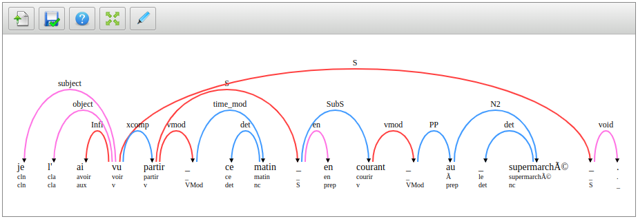
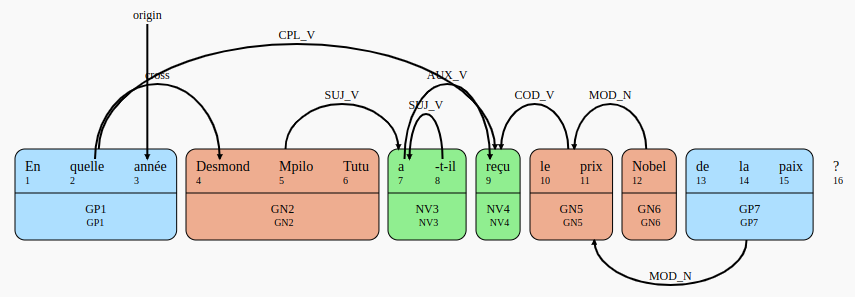

Dependency Graph Visualisation Library - DepGraph
=================================================




0\. Building
-----------------------------

This project use [grunt](https://gruntjs.com/) to build itself.

After cloning the repository and enter the directory, just run the following commands :

```
npm install
npm run build

```

You can now open the file index.html to see the examples


1\. Simple Use
-----------------------------

This library has 2 components : depgraph.js and viewer.js

*   viewer.js is the frame in which the graph will be embed. This module handle the creation of toolbar menus, size of the frame, floating windows, etc.
*   depgraph.js is the module that handle the actual graph layout creation in svg. This part of the library heavily rely on d3.js svg graphics library.

A simple exemple of how to display a graph (see [Graph Data Schema](#2-graph-data-schema) for `DATA` model):


```html
  <div id="graph-container"></div>
  <script>
    var json_data = DATA;
    var depGraph = new depgraphlib.DepGraph(jQuery("#graph-container"),json_data);
  </script>
  ```

The dependency to add in the `<head>` are :

```html
<!-- Lib includes js -->
<script type="text/javascript" src="http://code.jquery.com/jquery-1.8.1.min.js"></script>
<script type="text/javascript" src="http://code.jquery.com/ui/1.10.2/jquery-ui.js"></script>
<script type="text/javascript" src="src/js/vendor/colorbox/jquery.colorbox-min.js"></script>
<script type="text/javascript" src="src/js/vendor/jquery-contextMenu-master/jquery.contextMenu.js"></script>
<script type="text/javascript" src="src/js/vendor/d3.v2.min.js"></script>

<!-- DepGraph Lib js-->
<script src='build/depgraph.js'></script>

<!-- DepGraph Plugins js -->
<!-- <script type="text/javascript" src="plugins/frmg_parser_custom.js"></script> -->

<!-- Lib includes css -->
<link rel="stylesheet" media="screen" type="text/css"
href="src/js/vendor/jquery-contextMenu-master/jquery.contextMenu.css" />
<link rel="stylesheet" media="screen" type="text/css"
href="http://code.jquery.com/ui/1.10.2/themes/smoothness/jquery-ui.css" />

<!-- DepGraph Lib css -->
<link rel="stylesheet" media="screen" type="text/css"
href="build/style/depgraph.css" />
```


2\. Graph Data Schema
---------------------

For now, DepGraph accept only data in json format. The schema of the format is described below:  

```json
{
  graph:{
    words:\[
      {
        id:/\*string - REQUIRED id of the word\*/,
        label:/\*string - REQUIRED label of the word\*/,
        sublabels:\[/\*array of string - array of sublabels that will be displayed below the label\*/, ...\]
        #data : /\*object - other attributes\*/,
        #style : /\*object - style @see def style\*/,
      },
      ...
    \],
    links:\[
      {
        target : /\*string - REQUIRED word.id or chunk.id\*/
        source : /\*string - REQUIRED word.id or chunk.id\*/
        label : /\*string - REQUIRED visible label name\*/,
        #data : /\*object - other attributes\*/,
        #style : /\*object - style @see def style\*/,
      },
      ...
    \],
    chunks:\[
      {
        id:/\*string - REQUIRED id of the chunk\*/,
        elements:\[/\*array of string - REQUIRED array of words id that compose this chunk\*/\]
        label:/\*string - REQUIRED label of the chunk\*/,
        sublabels:\[/\*array of string - array of sublabels that will be displayed below the label\*/, ...\]
        #data : /\*object - other attributes\*/,
        #style : /\*object - style @see def style\*/,
      }     
    \],
    #style:{
      /\*
        object style define the global style of the graph. object style definition contain css-like style attributes :
          - background-color : background-color of the graph
          - margin : margin between graph and viewer borders
          - font-family : font family of the text
      \*/
    }
    #word-style:{
      /\*
        object style define words style of the graph. these values can be overriden in word #style attribute definition. 
        object style definition contain css-like style attributes :
          - margin : margin between words
          - sub-margin : margin between sub labels
          - font-size : size of font for label
          - sub-font-size : size of font of sublabels
          - color : color of the label
          - sub-color : color of the sublabels
          - font-weight : font weight of label
          - sub-font-weight : font weight of sublabels
          - font-style : font style of label
          - sub-font-style : font style of sublabels
          - font-family : font family of the text
      \*/
    }
    #link-syle:{
      /\*
        object style define links style of the graph. these values can be overriden in link #style attribute definition. 
        object style definition contain css-like style attributes :
          - margin : margin between arcs (roots)
          - font-size : font size of label
          - color : color of label
          - link-color : color of the link (prefer hex color for better highlighting)
          - link-size : width size of the links
          - font-weight : font weight of label
          - font-style : font style of label
          - oriented : (default true) true - display arrow at the end of edges, false - don't
          - higlighted : (default false) true - hightlight link, false - don't
      \*/
    }
    #chunk-style:{
      /\*
        object style define chunks style of the graph. these values can be overriden in chunk #style attribute definition. 
        object style definition contain css-like style attributes :
          - margin : margin between chunks
          - sub-margin : margin between label and words contained
          - font-size : font size of the label
          - sub-font-size : font size of the sublabels
          - background-color : background color of the chunk
          - color : color of the label
          - sub-color : color of the sublabels
          - border-color : color of the borders
          - font-weight : font weight of the label
          - sub-font-weight : font weight of the sublabel
          - font-style : font style of the label
          - sub-font-style : font style of the sublabel
          - border-size : width size of the borders
      \*/
    }
  }  
}
```

Note that the next version of the format will let you be able to bind values/object together, using referencing system.

3\. Advanced Options
--------------------

Change viewer modes (shrink to content, image mode, borders, ...) Use toolbar, alt content, tooltip and contextual menu.

4\. Edit Modes
--------------

### Default Mode


### Creating custom edit modes

see FRMGEditMode  
otherwise, code is open source, so feel free to add your own callback to 'vis.selectAll(g.links)' (for instance)

#### Required Callbacks

#### More Options

Loading a model :

  var model = {
    words : \[{name:label,values:\[a,b,c\],value-restrict:false,onchange:function(depgraph,label){}}\]
  }
  depgraph.editObject.loadModel(model);